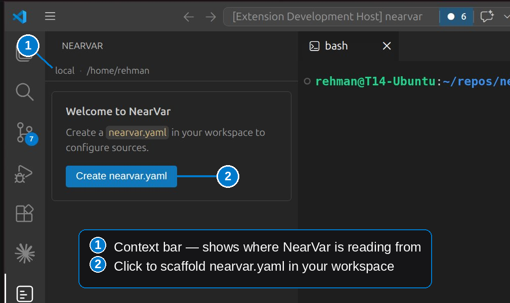
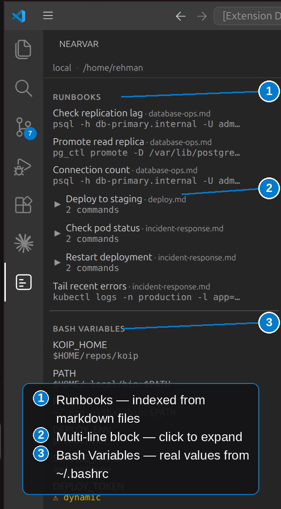
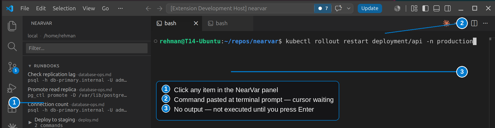
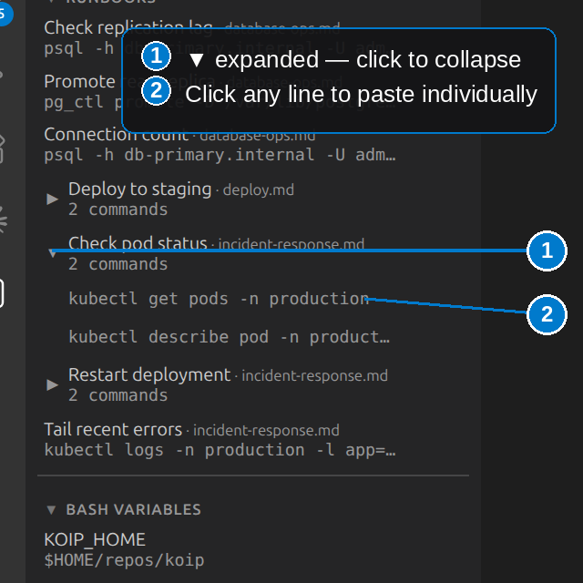
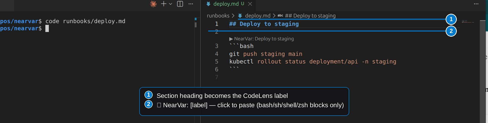
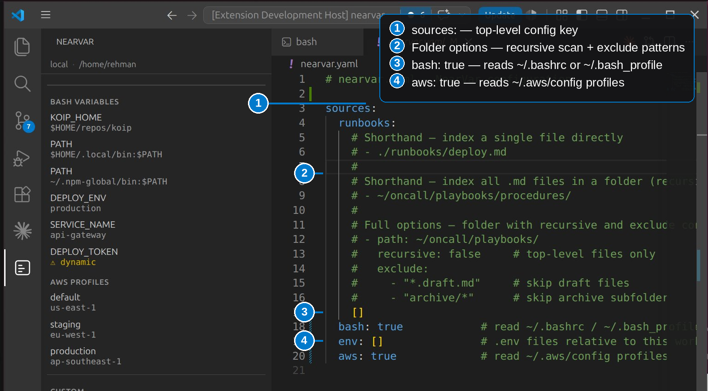
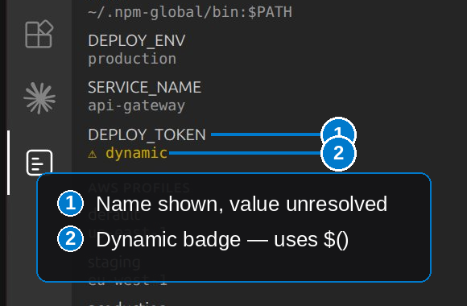
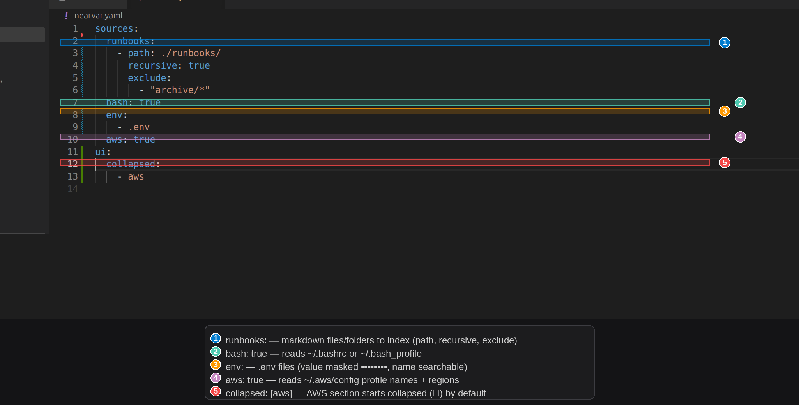
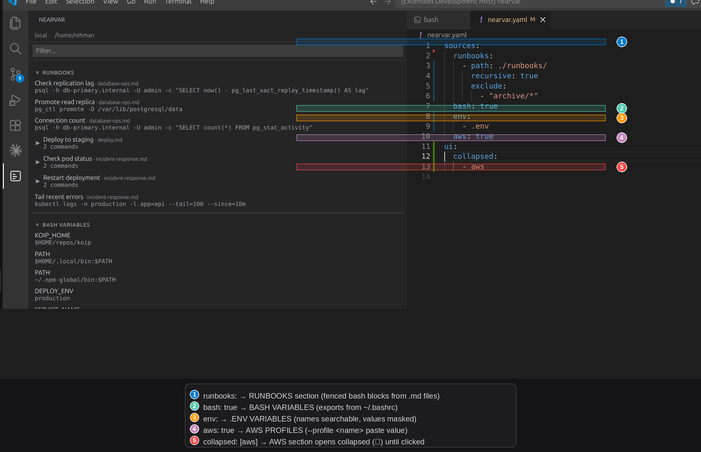

# NearVar

**Environment variables, cloud profiles, and runbook commands — always within reach.**

NearVar is a VS Code sidebar extension that surfaces your shell environment, AWS profiles, and runbook commands in a single persistent panel. Click any item to paste it into the active terminal — without executing it — so you always review before running.

## Screenshots


*First open — click Create nearvar.yaml to get started*


*All sections populated — Runbooks, Bash Variables, AWS Profiles, Custom*


*Click any item — command lands in terminal prompt, not executed*


*Multi-line runbook blocks expand to show individual pasteable commands*


*CodeLens above every fenced bash block — paste without leaving your runbook*


*nearvar.yaml — configure runbook sources, bash, env, and AWS profiles*


*Dynamic variables shown with badge — value uses $() substitution*

## Who this is for

- DevOps and platform engineers who run frequent commands from playbooks during incidents
- Developers managing multiple AWS profiles or .env files across projects
- On-call engineers who need runbook commands immediately during an outage

## Features

- **Runbook commands** — indexes fenced bash blocks from markdown files you configure. Supports `` ```bash ``, `` ```sh ``, `` ```shell ``, `` ```zsh ``
- **Bash variables** — reads `~/.bashrc` (Linux) or `~/.bash_profile` (macOS)
- **Environment files** — reads `.env` files in your workspace
- **AWS profiles** — reads `~/.aws/config` and `~/.aws/credentials`
- **Editor CodeLens** — click `▶ NearVar:` above any fenced block in a configured runbook to paste directly from the editor
- **Search/filter** — filter across all sections by name or value
- **Collapsible sections** — collapse sections you don't need right now, configurable per section in `nearvar.yaml`
- **Paste without executing** — text lands in the terminal prompt, you press Enter to run. Never executes automatically.

## Getting started

The simplest setup — works across every project forever:

1. Open your home folder in VS Code:
   **File → Add Folder to Workspace → select your home folder (~)**

2. Click the NearVar icon in the sidebar

3. Click **Create ~/nearvar.yaml** — file created at `~/nearvar.yaml`

4. Edit `~/nearvar.yaml` to point at your runbooks, .env files, and cloud profiles

NearVar will now work in every workspace you open, with no per-project setup required. `~/nearvar.yaml` lives alongside `~/.bashrc` and `~/.aws/config` — manage it the same way.

> **No workspace folder open?** NearVar still shows your bash variables and AWS profiles automatically — no config needed for those.

## Example configuration


*nearvar.yaml — all configuration options explained*


*Each config key maps directly to a panel section*

## Configuration

`nearvar.yaml` can live in your home directory (`~/nearvar.yaml`) or your workspace root — or both. NearVar checks both locations and deep-merges them when both are present (workspace values take precedence for booleans; arrays like `runbooks` and `env` are concatenated).

```yaml
# nearvar.yaml — NearVar configuration
sources:
  runbooks:
    # Single file
    - ./runbooks/deploy.md

    # Folder — recursive by default
    - ~/oncall/playbooks/procedures/

    # Folder with options
    - path: ~/oncall/playbooks/
      recursive: false        # top-level files only
      exclude:
        - "*.draft.md"
        - "archive/*"

  bash: true                  # read ~/.bashrc or ~/.bash_profile
  env:
    - .env                    # .env files relative to workspace
  aws: true                   # read ~/.aws/config profiles

ui:
  collapsed:                  # sections collapsed by default
    - aws                     # expand by clicking the header
```

## Runbook format

NearVar indexes fenced code blocks from markdown files. The section heading above the block becomes the item label:

~~~markdown
## Restart nginx

```bash
systemctl restart nginx
systemctl status nginx
```
~~~

Supported fence tags: `` ```bash `` `` ```sh `` `` ```shell `` `` ```zsh ``

Blocks without a heading above them are skipped. Inline backtick commands are not indexed — use fenced blocks.

## Search and filter

Type in the Filter box to search across all sections:

- Runbook items match by heading and command text
- Bash variables match by name and value
- AWS profiles match by name and region
- `.env` variables match by name only (values are never searched)
- Sections with no matches are hidden automatically

## Collapsible sections

Click any section header to collapse or expand it. Set default collapsed state in `nearvar.yaml`:

```yaml
ui:
  collapsed:
    - aws
    - custom
```

Valid section names: `runbooks`, `bash`, `env`, `aws`, `custom`

## What NearVar is not

- **Not a secrets manager** — no vault, no encryption, no sync
- **Not a command executor** — paste only, you always confirm with Enter
- **Not an auth manager** — if a resource is inaccessible, NearVar reports it and stops

## Security

NearVar is built with a security-first philosophy. Here is exactly what it does and does not do:

**What NearVar reads:**
- `~/.bashrc` or `~/.bash_profile` — variable names and values
- `.env` files you explicitly configure — variable names and values
- `~/.aws/config` — profile names and regions only
- `~/.aws/credentials` — profile names only, never key values
- Markdown runbook files you explicitly configure — fenced code blocks only

**What NearVar never does:**
- Never stores any data — variables, credentials, or commands are held in memory only while the panel is visible
- Never transmits any data — no analytics, no telemetry, no network calls of any kind
- Never executes commands — paste only, you always press Enter to run
- Never authenticates — if a resource is inaccessible, NearVar reports it and stops
- Never logs variable values — names may appear in debug output, values never do
- Never searches `.env` variable values — `.env` values are excluded from the search index to prevent accidental exposure

**How NearVar protects your data in the webview:**
- Content Security Policy (CSP) using VS Code's `webview.cspSource` — no external scripts, no inline execution
- All dynamic content (variable names, values, file paths, headings) is HTML-escaped before display — XSS is not possible through NearVar's rendering pipeline
- AWS secret key material (access key IDs and secret keys) is never read into memory — only profile names and regions are extracted from credentials files
- `.env` variable values are masked (••••••••) in the panel and excluded from the search index entirely

**Dependency security:**
- Minimal dependency footprint — only `js-yaml` (YAML parsing) and `minimatch` (glob pattern matching)
- Both dependencies are audited with `npm audit` before every release — zero known vulnerabilities at time of publish

**Open source:**
- Full source code available at [github.com/rehmansherazi/nearvar](https://github.com/rehmansherazi/nearvar)
- You can audit exactly what NearVar reads and how it handles your data

## Known limitations (v1)

- NearVar requires an open workspace folder — it will not load without one
- Keyboard navigation not implemented — use mouse to click items
- Remote URL and Git repository sources not supported — local filesystem only
- Azure and GCP profiles not yet supported (planned for v2)
- Inline bash commands (backtick) not indexed — use fenced blocks
- Escaped quotes inside variable values may parse incorrectly

## License

MIT
